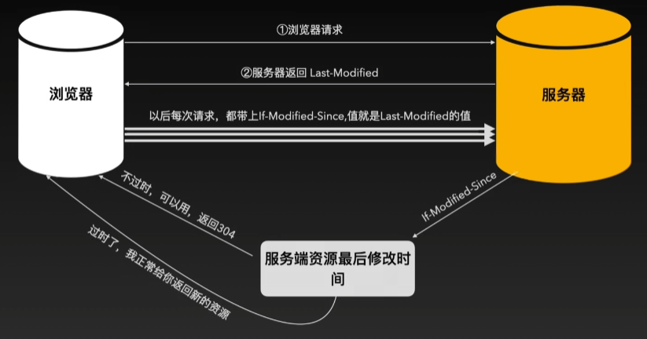

## 客户端
获取资源的电脑

## 服务器
存放对外提供资源的电脑

### 资源的类型
1. 文字内容
2. 图片
3. 音频
4. 视频
5. 文件
   1. html
   2. js
   3. css
6. 数据
   1. json

## 浏览器
客户端获取网络资源的常规工具

## URL地址（Uniform Resource Location）
统一资源定位符，标识互联网上每个资源的唯一存放地址

### 三部分组成
1. 通信协议，如：http、https
2. 服务器名称，如：www.baidu.com
   1. 域名
   2. 端口
3. 资源具体的位置,如：question/593018012264105525
   1. 路径
   2. 参数

## 客户端和服务端通信的过程

### 粗略过程
1. 向指定服务器发送资源请求--请求
2. 服务器处理请求--处理
   1. 接收到请求信息
   2. 在内部寻找请求资源
3. 找到资源，响应请求，将资源发送到客户端--响应

### 详细过程

1. 浏览器输入URL
2. 浏览器解析URL
3. 是否有缓存
   1. 是
      1. 缓存是否过期
         1. 是---->协商缓存（对比最后更新时间、ETag）
         2. 否---->读取本地缓存---->浏览器呈现
   2. 否
      1. 请求数据
      2. 浏览器呈现

### 缓存
缓存-----目的使浏览器打开的更快，减小服务器压力

expires---解决资源不更新，设置缓存过期时间

Cache-Control---解决客户端与服务端时间不匹配，设置缓存时长
1. max-age-------最大过期时长，单位秒
2. no-cache------不使用强缓存
3. no-store------禁止缓存
4. private-------只有浏览器可以缓存
5. public--------浏览器、服务器、代理服务器都可以缓存

为了减轻 过期缓存 造成的服务器压力，缓存分割为：
强缓存-----缓存没有过期时，浏览器直接使用
协商缓存---过期的缓存，咨询服务器是否继续有效

Last-Modified----最后修改时间---秒级别   -----（秒内）无修改，可使用缓存，则返回 304 状态

ETag----文件唯一标识 服务器响应资源时，加入唯一标识
if-None-Match  ETag的值，客户端请求时传入，服务对比ETag值是否改变，返回 304 状态码

### DNS域名解析---找到对应的IP地址

#### 1.本地解析

1. 浏览器DNS缓存中查找
2. 系统DNS缓存中查找
3. 本地HOST文件查找

#### 2.互联网域名服务器解析
本地DNS服务器
1. 自己的缓存中
2. 根服务器---返回（.com） COM顶级域名服务器
3. COM顶级域名服务器----返回（baidu.com） 权威域名服务器
4. 权威域名服务器，返回IP地址

### TCP三次握手
1.客户端--->服务端--------服务端是否可以收到信息
2.服务端---->客户端-------服务端可以接收，客户端是否能接收
3.客户端---->服务端-------客户端也可以接收

TCP字段解析
1. seq-----------------序列号
2. ack-----------------确认号，ack = seq+1
3. TCP标志位
   1. ACK--------------确认序列号有效，等于1--确认序号有效
   2. SYN--------------发起一个新连接，等于1--发起新链接

三次握手过程

### 客户端发送HTTP请求

### https加解密流程---数据传输安全
数据传输不安全

1. 对称加密：加密解密同一把钥匙的方式，依旧不安全

2. 非对称加密：私匙和公匙，不需要传输私钥，很安全，相对速度很慢
私钥----自己保存---------钥匙
公钥----传输加密使用-----锁

3. 结合后---提升速度-----依旧不安全，中间人可以把私钥和公钥替换成自己的，可以拿到后续数据
传输秘钥时，使用非对称加密，
通信时用，用对称加密 

4. 引入第三方机构CA数字签名
传输时，非对称
通信时，对称

### 服务器处理请求并返回HTTP资源

### TCP四次挥手断开连接
TCP字段解析
1. seq-------------序列号
2. ack-------------确认号
3. TCP标识位
   1. ACK----------确认序列号有效    1
   2. SYN----------发起连接         1
   3. FIN----------释放连接         1

TCP四次挥手

### 浏览器渲染页面（重绘和回流）
回流：倾向结构的调整，对性能影响更大
重绘：倾向样式的调整，对性能影响较小

### js执行机制

